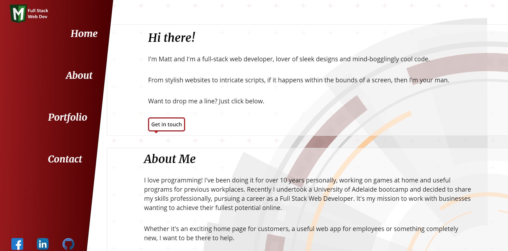

# Profile Website
### By trojanface

## Description
This is my portfolio website giving a brief explanation of who I am, an overview of the projects I've worked on and how to contact me if you want to work together. It is a responsive layout that adapts to any screen size and features a vertical menu on desktop, a sticky footer that resizes on all screens and responsive images.

## Link to Deployed App
https://trojanface.github.io/Portfolio/

## Usage
1. Navigate to https://trojanface.github.io/Portfolio/
2. Use the navbar along the side (desktop) or top (mobile) to jump to the different sections of my profile.
3. Use the social media links to visit my other accounts.
4. Use the email link to open an email in your default email application to contact me.

## License
Public Domain

